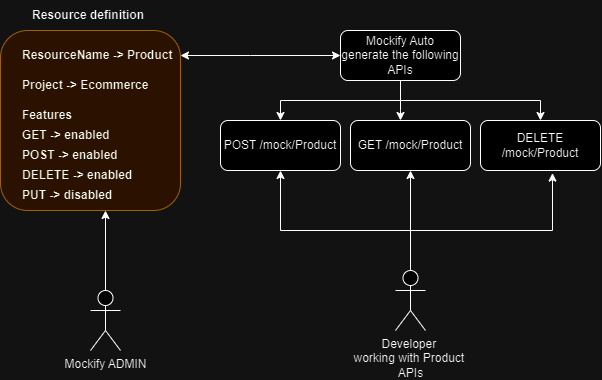
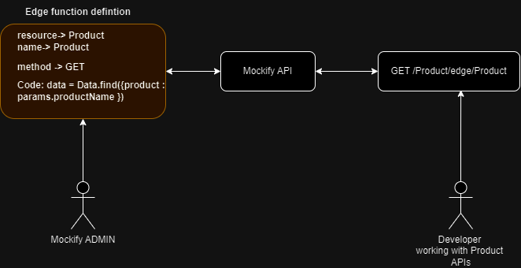

# View Auto-Generated Endpoints

Mockify auto-generates mock API endpoints based on two user actions.

## 1. Auto-generated generic based on resource definition
 
Based on resource creation and feature flagging in resource creation, Mockify auto-generates endpoints for those mocked resources. You can view them at the "Endpoint" tab, labeled as Generic. The schema for the URL is as follows:

```plaintext
https://<<domainName>>/mock/<resourceName>
```
For example if getx, putx in resource defination is enabled, then the following endpoints will be auto-generated:
    
```plaintext
GET -> https://<<domainName>>/mock/<resourceName>
PUT -> https://<<domainName>>/mock/<resourceName>
```


Note: each string enclosed with `< >` is a parameter.

## 2. Auto-generated based on edge function definition
 
Based on edge function definition, Mockify auto-generates endpoints when an Edge Function is created. The schema for the URL is as follows:

```plaintext
https://<<domainName>>/<resourceName>/edge/<edgeFunctionName>
```
Note : function feature flag should be enabled in the resource definition. Also the method the edge function uses should be enabled in the resource definition.

For example if getx, functions in resource defination is enabled, then we can create edge funnction as follow:
name -> test 
method -> GET
code -> code
resource -> resource

Then the following endpoints will be auto-generated:
    
```plaintext
GET -> https://<<domainName>>/<resourceName>/edge/test
```


Note: each string enclosed with `< >` is a URL parameter.
