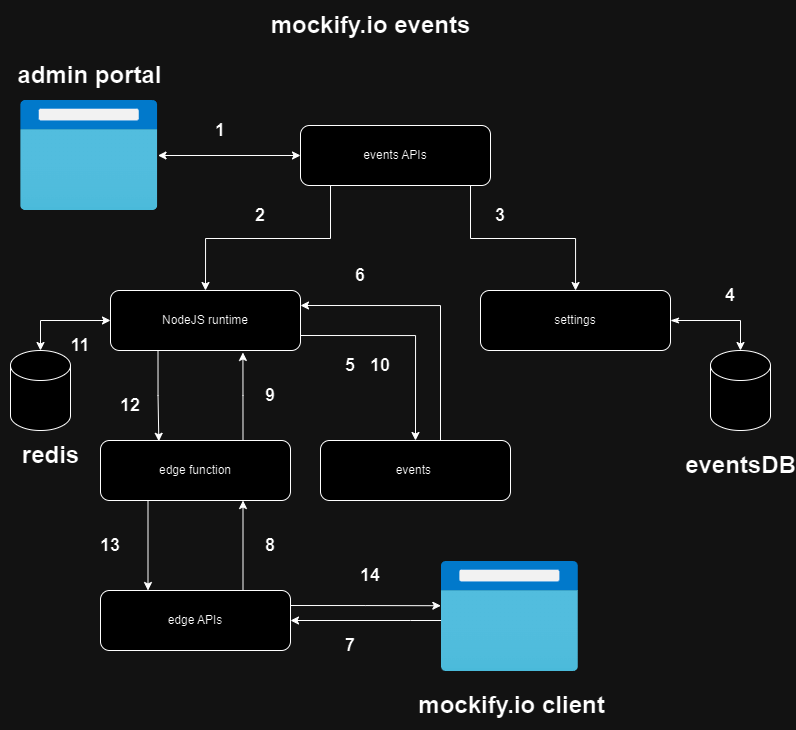

# Events



Events in [mockify.io](http://mockify.io) allow development  teams to mock event-driven architecture :

- Event name
- Event handler
- in-memory shared context Redis

**Control flow ( figure 1) :**

step 1) admin configure events in the admin portal

2) [Mockify.io](http://Mockify.io) uses NodeJS run time to create, update, delete events upon events REST API call 

3,4) events data are persisted to MongoDB

5) upon successful persistence the event is added to NodeJS EventEmitter. 

6) event is listening to an invoke from NodeJS runtime.

7) mockify client send request to an edge function with events in it.

8, 9) edge function invoke events, NodeJS publish the event

10, 11) event invoked with access to  shared memory ( redis db )

12,13, 14 ) events invoked edge function return response 

shared memory recommendation : 

- For data needed for multiple events set them without TTL
- For data needed only to handle event, group of events, set them  with TTL to avoid over whelming the machine memory with events data.
- keys must be set in this fashion event:eventName

The Event then can be invoked within an edge function :

```jsx
await Emit('event:eventName', params)
```

The content of an event is business logic, therefore events have all edge function context, including Emit, to chain events.

The events page is divided into two main pages :

1. Manage: User interface for  creating, editing, deleting, viewing events.
2. Handlers: Business logic invoked when the events are fired.