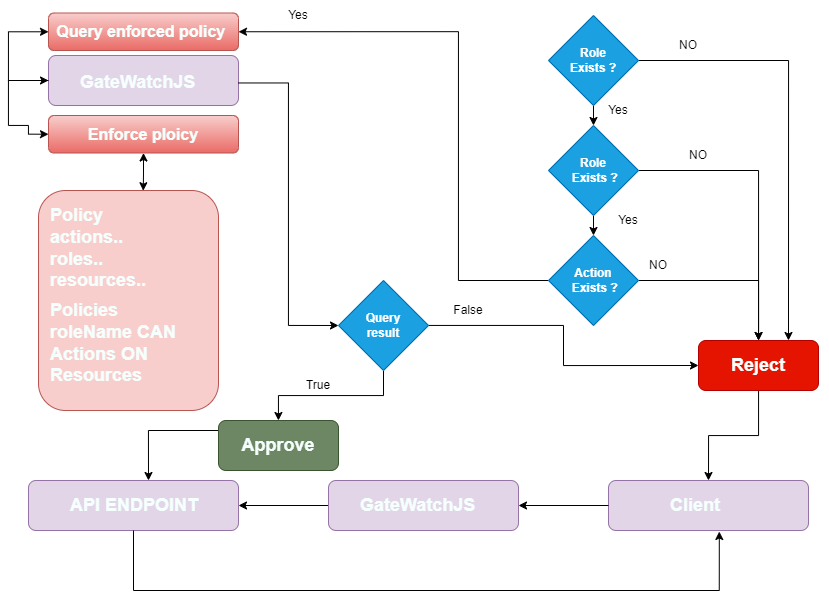

# Quick guide dynamic role-based access control

The policies page is for managing mockify policies, where you can create, edit, and delete policies. Policies can be used in edge functions to mock real-world APIs access control with ease thanks to the gatewatchJS library. The diagram below explains how the library works:



For more information, visit the [gatewatchJS GitHub page](https://github.com/ARAldhafeeri/gatewatch).

---

## Manage Mockify Policies

### 1. Create Policy

1. Click on the policies tab.
2. From the top-right corner at the end of the policies tab, click on the "+" icon.
3. A modal will appear with form steps.
4. Form steps:
   4.1. Resource: Use the "+" icon to add resources to the policy and "-" icon to remove resources from the policy definition.
   4.2. Action: Use the "+" icon to add actions to the policy and "-" icon to remove actions from the policy definition.
   4.3. Roles: Use the "+" icon to add roles to the policy and "-" icon to remove roles from the policy definition.
   4.4. Role: Note that you can add as many roles, actions, and resources as the policy needs.
   4.5. After adding actions, resources, and roles, you can create policies as follows: `role roleName can perform [<actions>] on [<resources>]`.
   4.6. Click on the "Add Policy" button, type in the role name, and add the resources and actions added in steps 1-3.
   4.7. Preview the created policy/policies.
   4.8. Click on the "Create Policy" button.

### 2. Edit Policy

1. Click on the policies tab.
2. Click on the edit icon.
3. A modal will appear with form steps.
4. Form steps:
   4.1. Resource: Use the "+" icon to add resources to the policy and "-" icon to remove resources from the policy definition.
   4.2. Action: Use the "+" icon to add actions to the policy and "-" icon to remove actions from the policy definition.
   4.3. Roles: Use the "+" icon to add roles to the policy and "-" icon to remove roles from the policy definition.
   4.4. Role: Note that you can add as many roles, actions, and resources as the policy needs.
   4.5. After adding actions, resources, and roles, you can create policies as follows: `role roleName can perform [<actions>] on [<resources>]`.
   4.6. Click on the "Add Policy" button, type in the role name, and add the resources and actions added in steps 1-3.
   4.7. Preview the edited policy/policies.
   4.8. Click on the "Update Policy" button.

### 3. Delete Policy

3.1. Click on the policies tab.
3.2. Click on the delete icon in the actions column for the policy you want to delete.
3.3. Click "Yes".


## Examples with edge functions and gatewatch 

Certainly! Here are examples of edge functions using Gatewatch, along with brief explanations for each:

### Example 1: Check User Authorization

```javascript
// Check if the user is authorized to perform a specific action on a resource
const isAuthorized = new GrantQuery(enforcedPolicy)
  .role(user.role)
  .can(["delete", "create", "update"])
  .on(["post"])
  .or(user._id === post.creator._id)
  .grant();

// Update the response data based on authorization status
data = { authorized: isAuthorized };
```

This example demonstrates how to use Gatewatch within an edge function to check user authorization for specific actions on a resource. Adjust the roles, actions, and resource conditions according to your access control policy.

### Example 2: Dynamic Access Control with Gatewatch

```javascript
// Perform dynamic access control check using Gatewatch
const dynamicAccess = new GrantQuery(enforcedPolicy)
  .role("user")
  .can(["read"])
  .on(["dynamicResource"])
  .or(user._id === "specialUser")
  .grant();

// Update the response data based on dynamic access control status
data = { dynamicAccess: dynamicAccess };
```

This example showcases dynamic access control using Gatewatch within an edge function. Modify the roles, actions, and resource conditions to fit your specific use case.

### Example 3: Conditional Grant Based on Faker Data

```javascript
// Generate fake data using Faker
const fakeData = {
  username: faker.internet.userName(),
  email: faker.internet.email(),
  isAdmin: faker.random.boolean(),
  // Add other fields as needed
};

// Grant access conditionally based on generated fake data
const conditionalGrant = new GrantQuery(enforcedPolicy)
  .role("user")
  .can(["read"])
  .on(["fakeResource"])
  .and(fakeData.isAdmin)
  .grant();

// Update the response data based on conditional grant status
data = { conditionalGrant: conditionalGrant };
```

This example combines the use of Gatewatch with Faker to conditionally grant access based on generated fake data. Adjust the conditions, actions, and resources as per your requirements.

These examples serve as starting points for incorporating Gatewatch into your edge functions for dynamic access control and authorization checks. Adjust the queries, roles, actions, and resource conditions according to your specific access control policies and use cases.